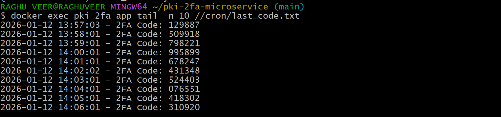
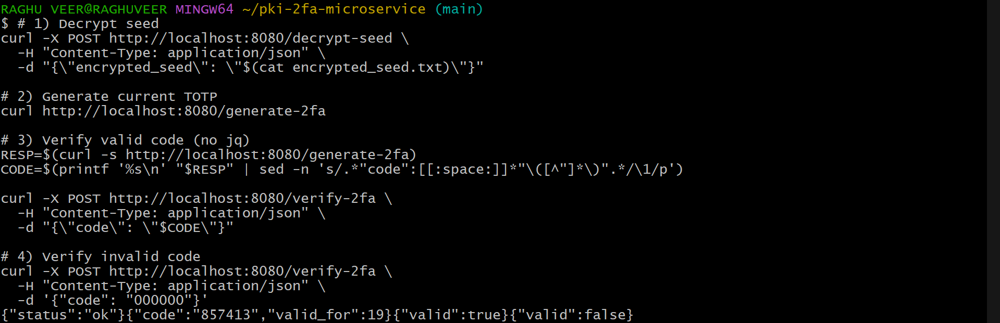
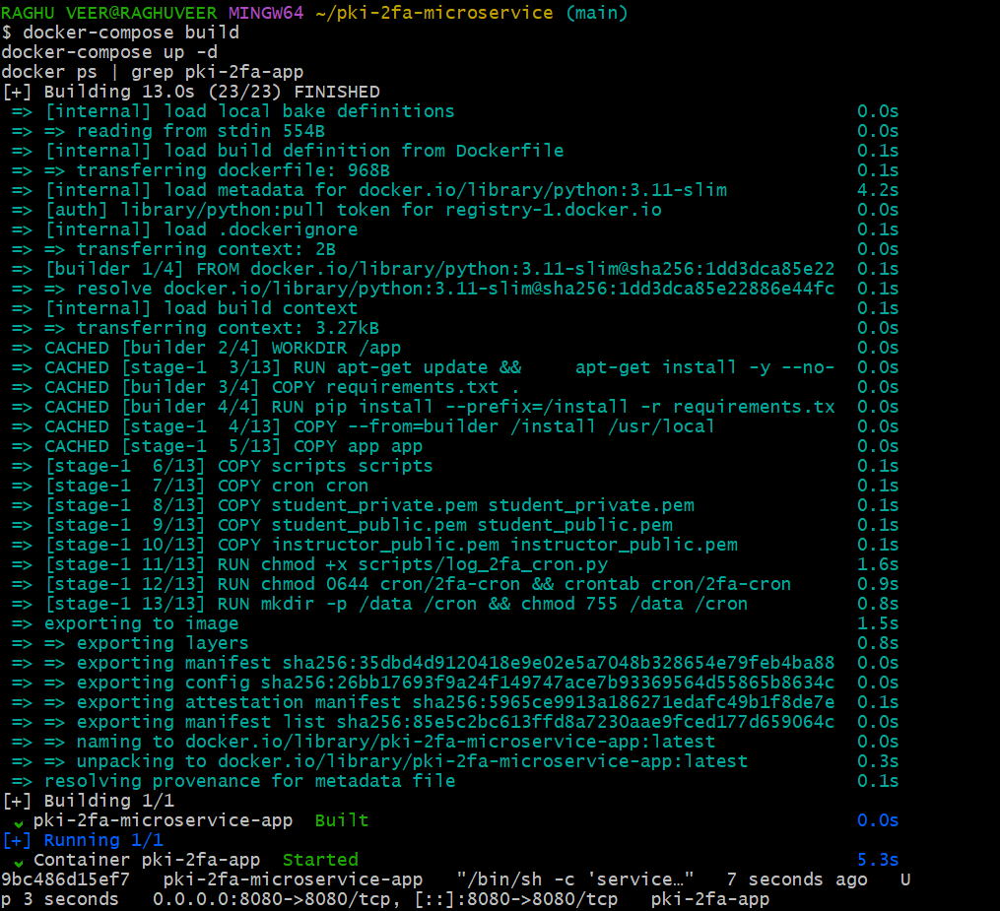
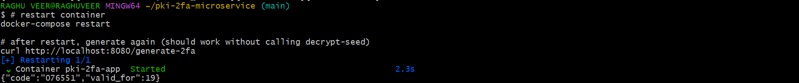

# PKI-Based TOTP 2FA Microservice

Enterprise authentication microservice using RSA 4096-bit encryption and TOTP-based two-factor authentication.

## Overview

- **RSA/OAEP** encryption with SHA-256
- **TOTP 2FA** with 30-second periods
- **Docker** containerization with persistent volumes
- **Automated cron** for continuous logging
- **FastAPI** REST endpoints

## Architecture

```
FastAPI (Port 8080)
├── POST /decrypt-seed   → RSA/OAEP Decryption
├── GET  /generate-2fa   → TOTP Generation
└── POST /verify-2fa     → TOTP Verification

Volumes: /data/seed.txt, /cron/last_code.txt
```

## Quick Start

```bash
# Clone and setup
git clone https://github.com/lohithadamisetti123/pki-2fa-microservice
cd pki-2fa-microservice
pip install -r requirements.txt

# Generate keys
python scripts/generate_keys.py

# Get instructor key
curl -L https://partnr-public.s3.us-east-1.amazonaws.com/gpp-resources/instructor_public.pem -o instructor_public.pem

# Request seed (edit STUDENT_ID and GITHUB_REPO_URL first)
python scripts/request_seed.py

# Build and run
docker-compose build
docker-compose up -d

# Test endpoints
curl -X POST http://localhost:8080/decrypt-seed \
  -H "Content-Type: application/json" \
  -d "{\"encrypted_seed\": \"$(cat encrypted_seed.txt)\"}"

curl http://localhost:8080/generate-2fa

# Verify cron (wait 70+ seconds)
docker exec pki-2fa-app cat //cron/last_code.txt

# Test persistence
docker-compose restart
curl http://localhost:8080/generate-2fa
```

## API Endpoints

### POST /decrypt-seed
```json
Request:  {"encrypted_seed": "BASE64..."}
Response: {"status": "ok"}
```

### GET /generate-2fa
```json
Response: {"code": "123456", "valid_for": 25}
```

### POST /verify-2fa
```json
Request:  {"code": "123456"}
Response: {"valid": true}
```

## Project Structure

```
pki-2fa-microservice/
├── app/
│   ├── main.py              # FastAPI app
│   └── crypto_utils.py      # Crypto operations
├── scripts/
│   ├── generate_keys.py
│   ├── request_seed.py
│   ├── log_2fa_cron.py
│   └── generate_commit_proof.py
├── cron/2fa-cron
├── student_private.pem
├── student_public.pem
├── instructor_public.pem
├── Dockerfile
├── docker-compose.yml
└── requirements.txt
```

## Screenshots

### Cron Job Output


### API Tests


### Docker Build


### Persistence Test


## Key Features

**Cryptography:**
- RSA 4096-bit (exponent 65537)
- OAEP with SHA-256 + MGF1
- PSS signatures with max salt

**TOTP:**
- SHA-1, 30s period, 6 digits
- ±30s tolerance window
- Hex seed → Base32 encoding

**Docker:**
- Multi-stage build
- UTC timezone
- Persistent volumes
- Cron every minute

## Submission

```bash
# Generate proof
git add .
git commit -m "Final implementation"
git push origin main
python -m scripts.generate_commit_proof
```

**Required Items:**
1. GitHub URL: `https://github.com/lohithadamisetti123/pki-2fa-microservice`
2. Commit hash: `git log -1 --format=%H`
3. Encrypted signature: From commit proof script
4. Student public key: `student_public.pem` contents
5. Encrypted seed: `encrypted_seed.txt` contents

## Security Notes

⚠️ **Keys are PUBLIC** - Educational use only  
⚠️ Never reuse for production  
⚠️ `encrypted_seed.txt` excluded from Git

## Troubleshooting

```bash
# Module import error
python -m scripts.generate_commit_proof

# Check cron
file cron/2fa-cron  # Should be LF

# Check volumes
docker volume ls | grep pki-2fa

# Check logs
docker logs pki-2fa-app
```

## Dependencies

```txt
fastapi>=0.128.0
uvicorn[standard]>=0.40.0
cryptography>=46.0.0
pyotp>=2.9.0
python-multipart>=0.0.21
requests>=2.32.0
```

## Author

Student ID: 23MH1A4413  
GitHub: [@lohithadamisetti123](https://github.com/lohithadamisetti123)
